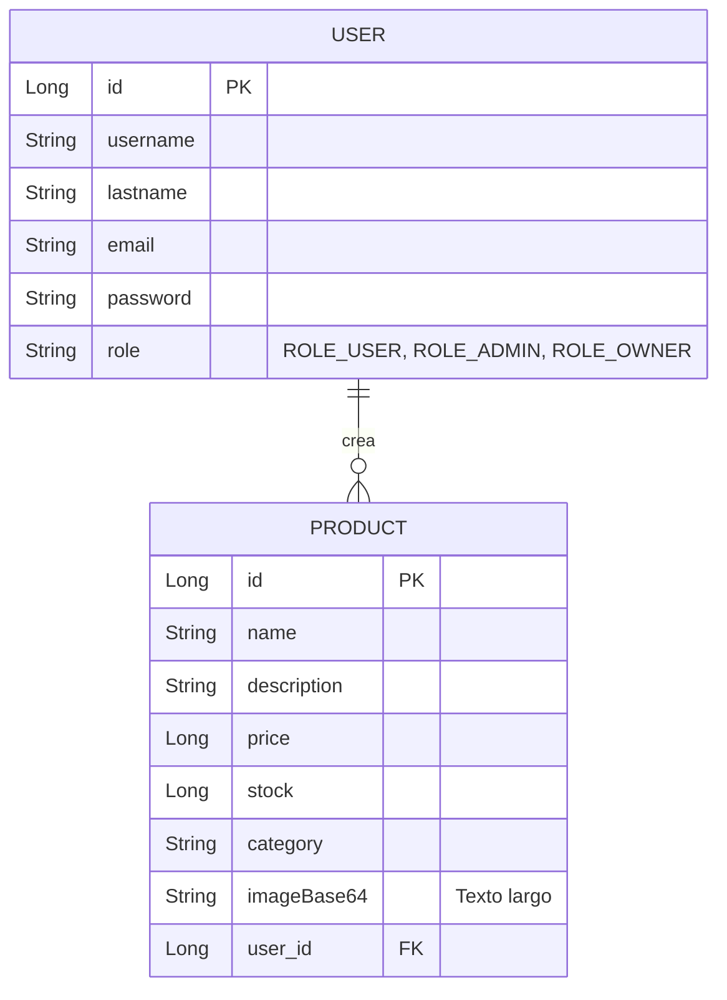
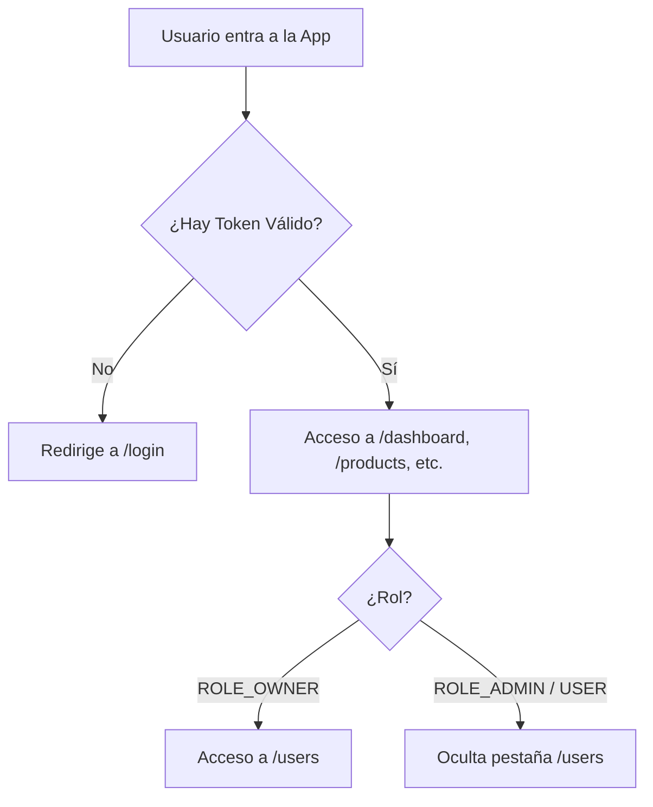

# Documentación Oficial - Sistema de Inventario Farmacéutico

Esta documentación describe la arquitectura, lógica y flujo de datos del Sistema de Inventario Farmacéutico, compuesto por un Backend en Spring Boot y un Frontend en Angular 17.

## 1. Arquitectura General

El sistema sigue una arquitectura cliente-servidor clásica. El cliente (Angular) consume una API RESTful expuesta por el servidor (Spring Boot). La persistencia de datos se maneja en PostgreSQL.

```mermaid
graph TD
    Client[Cliente: Navegador Web / Móvil] -->|HTTP / REST (JSON) + JWT| Frontend[Frontend: Angular 17]
    Frontend -->|Peticiones HTTP (Axios/Fetch)| API[Backend: Spring Boot 3 API]
    
    API -->|Autenticación| Security[Spring Security + JWT Filter]
    Security --> Controller[Controladores REST]
    Controller --> Service[Capa de Servicios]
    Service --> Repository[Spring Data JPA]
    Repository -->|JDBC| DB[(PostgreSQL)]
```

---

## 2. Backend (Spring Boot 3 + Java 17)

El backend expone todos los endpoints necesarios para la gestión de autenticación, usuarios y productos.

### 2.1 Modelo de Datos (Entidades)

El sistema cuenta principalmente con dos entidades que tienen una relación de "Uno a Muchos" (Un Usuario puede registrar muchos Productos).



**Fragmento de Código - Entidad Producto (`Product.java`):**
```java
@Entity
@Table(name = "Product")
public class Product {
    @Id
    @GeneratedValue(strategy = GenerationType.IDENTITY)
    private Long id;
    
    private String name;
    private String description;
    private Long price;
    private Long stock;
    private String category;
    
    @Column(columnDefinition = "TEXT")
    private String imageBase64;

    // Relación: Muchos productos pertenecen a un usuario
    @ManyToOne
    @JoinColumn(name = "user_id", nullable = false)
    private User user;
    
    // Getters y Setters...
}
```

### 2.2 Seguridad (Spring Security y JWT)

Toda la aplicación está protegida mediante Tokens JWT sin estado (Stateless). Se configuraron reglas de acceso muy estrictas basadas en roles.

**Reglas de Acceso (`SpringSecurityConfig.java`):**
```java
.authorizeHttpRequests(auth -> auth
    // Rutas públicas
    .requestMatchers(HttpMethod.OPTIONS, "/**").permitAll()
    .requestMatchers("/api/auth/**").permitAll()
    
    // Lectura de productos: Cualquier usuario logueado
    .requestMatchers(HttpMethod.GET, "/api/products/**").authenticated()
    
    // Gestión de usuarios: Solo el DUEÑO
    .requestMatchers("/api/users/**").hasRole("OWNER")
    
    // Creación, Edición y Eliminación de productos: ADMIN y DUEÑO
    .requestMatchers(HttpMethod.POST, "/api/products/**").hasAnyRole("ADMIN", "OWNER")
    .requestMatchers(HttpMethod.PUT, "/api/products/**").hasAnyRole("ADMIN", "OWNER")
    .requestMatchers(HttpMethod.DELETE, "/api/products/**").hasAnyRole("ADMIN", "OWNER")
    
    .anyRequest().permitAll())
```

### 2.3 Lógica de Negocio: Inventario Global

El inventario es **global**. Todos los usuarios autenticados pueden ver todos los productos. Sin embargo, al actualizar un producto, el sistema respeta al creador original.

**Fragmento de Código - (`ProductServiceImpl.java`):**
```java
@Override
@Transactional(readOnly = true)
public Page<Product> findAllForCurrentUser(Pageable pageable) {
    // Retorna TODO el inventario de la BD (sin filtrar por usuario)
    return productRepository.findAll(pageable);
}

@Override
@Transactional
public Product updateForCurrentUser(Long id, Product product) {
    Product existing = productRepository.findById(id)
            .orElseThrow(() -> new ResponseStatusException(HttpStatus.NOT_FOUND, "Producto no encontrado"));

    product.setId(id);
    // IMPORTANTE: Se conserva al creador original del producto, no se sobrescribe
    product.setUser(existing.getUser()); 
    return productRepository.save(product);
}
```

---

## 3. Frontend (Angular 17)

El frontend está construido usando la nueva API de **Signals** de Angular 17, lo que permite un manejo de estado altamente reactivo y sin necesidad de RxJS excesivo. 

### 3.1 Flujo y Enrutamiento (Guards)
Las rutas están protegidas por `authGuard`, el cual verifica si el token JWT existe antes de permitir la navegación.



### 3.2 Manejo de Estado (Signals)
En lugar de mutar variables tradicionales, se utilizan `signals` para actualizar la vista instantáneamente cuando cambian los datos, por ejemplo, en el buscador.

**Fragmento de Código - Filtrado Reactivo (`product.component.ts`):**
```typescript
// Señal que almacena el texto del buscador global
searchTerm = this.service.searchTerm;

// Computed Signal: Si el searchTerm o la lista de products cambia, 
// se recalcula la lista filtrada automáticamente.
filteredProducts = computed(() => {
  const term = this.searchTerm().toLowerCase();
  return this.products().filter(
    (p) => p.name.toLowerCase().includes(term) || p.description.toLowerCase().includes(term)
  );
});
```

### 3.3 Diseño Responsivo (Tabla a Tarjetas)
Para evitar el molesto scroll horizontal en dispositivos móviles, se utilizó una técnica CSS avanzada. En pantallas menores a `768px`, las filas de la tabla (`<tr>`) se convierten en bloques (`display: block`), pareciendo tarjetas, y usando `data-label` para inyectar el nombre de la columna.

**Fragmento de Código CSS (`product.component.css`):**
```css
@media (max-width: 768px) {
  /* Se oculta la cabecera original */
  .data-table thead { display: none; }
  
  /* Cada fila se vuelve una tarjeta */
  .data-table tr {
    display: block;
    margin-bottom: 16px;
    border: 1px solid var(--outline-variant);
    border-radius: 8px;
    padding: 12px;
  }
  
  /* Cada celda se vuelve un renglón flexible */
  .data-table td {
    display: flex;
    justify-content: space-between;
  }
  
  /* El CSS inyecta el texto del atributo data-label (Ej: "PRECIO") */
  .data-table td::before {
    content: attr(data-label);
    font-weight: 600;
  }
}
```

### 3.4 Visor de Imágenes y Detalles (Modales)
El frontend implementa ventanas flotantes (Modales) desarrolladas con HTML y CSS puro para mostrar la imagen en grande y los detalles (como quién registró el producto).

**Fragmento de Código HTML (`product.component.html`):**
```html
<!-- Modal de Detalles del Producto -->
@if (productDetails()) {
  <div class="modal-overlay">
    <div class="modal-card">
      <h3>Detalles del Artículo</h3>
      <p><strong>Nombre:</strong> {{ productDetails()!.name }}</p>
      <p><strong>Stock:</strong> {{ productDetails()!.stock }} unidades</p>
      
      <!-- Muestra el creador del producto accediendo a user.username -->
      <p><strong>Subido por:</strong> {{ productDetails()!.user?.username || 'Sistema' }}</p>
      
      <button (click)="productDetails.set(null)">Cerrar</button>
    </div>
  </div>
}
```

---

## 4. Resumen de Flujo de Operaciones

1. **Autenticación**: El usuario se loguea en `/login`, el backend devuelve un token JWT.
2. **Navegación**: El JWT se guarda en LocalStorage. El Interceptor HTTP (`auth.interceptor.ts`) añade este token en cada petición al backend.
3. **Consulta de Productos**: 
   - El cliente envía `GET /api/products`.
   - El backend verifica el token, acepta la petición y retorna todos los productos con sus dueños.
4. **Búsqueda**: Al escribir en el buscador de la cabecera superior, una señal `searchTerm` cambia, el `computed` reevalúa el arreglo, y Angular actualiza el DOM instantáneamente.
5. **Edición**: Solo si eres ADMIN u OWNER, se te permite enviar `PUT /api/products/{id}`. El backend conserva el usuario original para mantener un buen historial.
