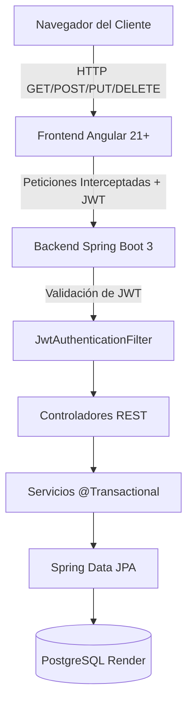

# Documentación Técnica Exhaustiva - Sistema de Inventario Farmacéutico

Esta documentación técnica detalla el propósito, la lógica y el código de **cada uno de los archivos cruciales** que conforman este sistema CRUD en su versión más moderna.

---

## ÍNDICE
1. [Arquitectura del Sistema](#1-arquitectura-del-sistema)
2. [Backend: Base de Datos y Entidades](#2-backend-base-de-datos-y-entidades)
3. [Backend: Repositorios (Acceso a Datos)](#3-backend-repositorios-acceso-a-datos)
4. [Backend: Seguridad (Spring Security y JWT)](#4-backend-seguridad-spring-security-y-jwt)
5. [Backend: Servicios (Lógica de Negocio)](#5-backend-servicios-lógica-de-negocio)
6. [Backend: Controladores (Endpoints REST)](#6-backend-controladores-endpoints-rest)
7. [Frontend: Modelos y Servicios HTTP](#7-frontend-modelos-y-servicios-http)
8. [Frontend: Ruteo y Seguridad (Guards/Interceptors)](#8-frontend-ruteo-y-seguridad)
9. [Frontend: Componente Raíz y Estado Global](#9-frontend-componente-raíz-y-estado-global)
10. [Frontend: Componentes de Autenticación (Login/Registro) con Signal Forms](#10-frontend-componentes-de-autenticación)
11. [Frontend: Módulo de Productos y Signal Forms](#11-frontend-módulo-de-productos-y-signal-forms)
12. [Frontend: Módulo de Usuarios y Estilos CSS](#12-frontend-módulo-de-usuarios-y-estilos-css)

---

## 1. Arquitectura del Sistema

El sistema utiliza una arquitectura **desacoplada**.
*   **Backend:** Spring Boot 3 con Java 17, actuando como una API RESTful sin estado (*Stateless*).
*   **Frontend:** Angular 21+ utilizando `Standalone Components`, `Signals`, y `Signal Forms`.



---

## 2. Backend: Base de Datos y Entidades

Ubicación: `backend/src/main/java/com/juanchis/.../entities/`

### `Product.java`
Representa un registro de inventario. Recientemente se agregaron los campos `stock` y `category`.
```java
@Entity
@Table(name = "Product")
public class Product {
    @Id
    @GeneratedValue(strategy = GenerationType.IDENTITY)
    private Long id;
    
    private String name;
    private String description;
    private Long price;
    private Long stock; // Nuevo: Cantidad en almacén
    private String category; // Nuevo: Categoría del producto
    
    @Column(columnDefinition = "TEXT")
    private String imageBase64; // Almacena la imagen en Base64

    @ManyToOne(fetch = FetchType.EAGER)
    @JoinColumn(name = "user_id")
    private User user; // Creador del producto
    // Getters y Setters...
}
```

### `User.java`
Entidad que implementa `UserDetails` de Spring Security para el manejo de sesión.
```java
@Entity
@Table(name = "users")
public class User implements UserDetails {
    @Id
    @GeneratedValue(strategy = GenerationType.IDENTITY)
    private Long id;

    @Column(unique = true)
    private String username;
    private String lastname;
    @Column(unique = true)
    private String email;
    private String password;
    private String role; // Ej. ROLE_USER, ROLE_ADMIN, ROLE_OWNER
    
    @Override
    public Collection<? extends GrantedAuthority> getAuthorities() {
        return List.of(new SimpleGrantedAuthority(role));
    }
}
```

---

## 3. Backend: Repositorios (Acceso a Datos)

Ubicación: `backend/src/main/java/com/juanchis/.../repositories/`

### `ProductRepository.java` y `UserRepository.java`
Interfaces de Spring Data JPA que abstraen las sentencias SQL.
```java
public interface ProductRepository extends JpaRepository<Product, Long> {
    // Provee métodos como findAll(), save(), findById() y deleteById()
}

public interface UserRepository extends JpaRepository<User, Long> {
    Optional<User> findByEmail(String email); // Buscar usuario por correo para Login
    Optional<User> findByUsername(String username);
}
```

---

## 4. Backend: Seguridad (Spring Security y JWT)

Ubicación: `backend/src/main/java/com/juanchis/.../security/`

### `SpringSecurityConfig.java`
Define las políticas CORS y las reglas de acceso por URL.
```java
@Bean
public SecurityFilterChain securityFilterChain(HttpSecurity http) throws Exception {
    return http
        .cors(Customizer.withDefaults())
        .csrf(AbstractHttpConfigurer::disable) // Desactivado para API Stateless
        .sessionManagement(s -> s.sessionCreationPolicy(SessionCreationPolicy.STATELESS))
        .authorizeHttpRequests(auth -> auth
            .requestMatchers("/api/auth/**").permitAll() // Login/Registro libres
            .requestMatchers(HttpMethod.GET, "/api/products/**").authenticated() // Ver inventario global
            .requestMatchers("/api/users/**").hasRole("OWNER") // Panel de dueños
            .requestMatchers(HttpMethod.POST, "/api/products/**").hasAnyRole("ADMIN", "OWNER")
            .requestMatchers(HttpMethod.PUT, "/api/products/**").hasAnyRole("ADMIN", "OWNER")
            .requestMatchers(HttpMethod.DELETE, "/api/products/**").hasAnyRole("ADMIN", "OWNER")
            .anyRequest().permitAll())
        .addFilterBefore(jwtAuthenticationFilter, UsernamePasswordAuthenticationFilter.class)
        .build();
}
```

### `JwtAuthenticationFilter.java`
Filtro que intercepta las peticiones, lee la cabecera `Authorization`, extrae el Token, valida la firma, y si es correcto, inyecta al usuario en el contexto de Spring Security.

---

## 5. Backend: Servicios (Lógica de Negocio)

Ubicación: `backend/src/main/java/com/juanchis/.../services/`

### `ProductServiceImpl.java`
Maneja transaccionalidad. La versión más reciente expone **todo el inventario global** a los usuarios, independientemente de quién lo creó.
```java
@Override
@Transactional(readOnly = true)
public Page<Product> findAllForCurrentUser(Pageable pageable) {
    // Permite que todos los usuarios autenticados vean todos los productos
    return productRepository.findAll(pageable);
}

@Override
@Transactional
public Product updateForCurrentUser(Long id, Product product) {
    Product existing = productRepository.findById(id).orElseThrow();
    product.setId(id);
    product.setUser(existing.getUser()); // Preserva al creador original intacto
    return productRepository.save(product);
}
```

---

## 6. Backend: Controladores (Endpoints REST)

Ubicación: `backend/src/main/java/com/juanchis/.../controllers/`

### `ProductController.java`
Recibe peticiones HTTP, parsea JSON y devuelve Códigos HTTP (`200 OK`, `201 CREATED`).
```java
@RestController
@RequestMapping("/api/products")
public class ProductController {
    @GetMapping
    public ResponseEntity<Page<Product>> list(...) { ... }
    
    @PostMapping
    public ResponseEntity<Product> create(@RequestBody Product product) {
        return ResponseEntity.status(HttpStatus.CREATED).body(productService.createForCurrentUser(product));
    }
}
```

---

## 7. Frontend: Modelos y Servicios HTTP

Ubicación: `frontend/src/app/...`

### `product.ts` (Modelo)
Interfase exacta de la base de datos para tipado fuerte en TypeScript.
```typescript
export class Product {
  id!: number;
  name!: string;
  description!: string;
  price!: number;
  stock!: number;
  category!: string;
  imageBase64?: string;
  user?: User; // Incluye el creador del producto
}
```

### `product.service.ts` y `auth.service.ts`
Usa `HttpClient` para conectar con el backend Spring Boot. Gestionan observables y guardan el Token localmente en `localStorage`.

---

## 8. Frontend: Ruteo y Seguridad

### `auth.interceptor.ts`
Un interceptor HTTP que inyecta automáticamente el JWT en el Header `Authorization` de todas las peticiones salientes.
### `auth.guard.ts`
Bloquea el acceso a rutas protegidas (`/dashboard`) usando Angular Router si `authService.isAuthenticated()` es falso.

---

## 9. Frontend: Componente Raíz y Estado Global

### `app.component.ts`
Gestiona la búsqueda global mediante Signals.
```typescript
export class AppComponent {
  public productService = inject(ProductService);
  
  // Limpia el buscador y vacía la señal
  clearSearch(input: HTMLInputElement) {
    input.value = '';
    this.productService.searchTerm.set(''); 
  }
}
```

---

## 10. Frontend: Componentes de Autenticación (Signal Forms)

Ubicación: `frontend/src/app/features/auth/`

### `login.component.ts` y `register.component.ts`
Migrados completamente a la nueva y estricta API de **Signal Forms** (`@angular/forms/signals`) disponible en Angular 21. Se eliminó `FormBuilder` y se utilizan esquemas reactivos:
```typescript
  protected readonly loginModel = signal({ email: '', password: '' });

  protected readonly loginForm = form(this.loginModel, (s) => {
    required(s.email, { message: 'Email es requerido' });
    email(s.email, { message: 'Email inválido' });
    required(s.password);
  });

  onSubmit() {
    // submit DEBE ser async y retornar promesa
    submit(this.loginForm, async () => {
       const { email, password } = this.loginModel();
       this.authService.login(...);
    });
  }
```

En las plantillas HTML, se usa la directiva `[formField]` para enlazar:
```html
<input type="email" [formField]="loginForm.email" />
@if (loginForm.email().touched() && loginForm.email().errors().length) {
  <span>{{ loginForm.email().errors()[0].message }}</span>
}
```

---

## 11. Frontend: Módulo de Productos y Signal Forms

Ubicación: `frontend/src/app/products/`

### `product-form.component.ts` y `.html`
Igualmente refactorizados para usar **Signal Forms** y validaciones nativas de la nueva API, incluyendo los nuevos campos `stock` y `category`.
```typescript
  protected readonly productForm = form(this.productModel, (s) => {
    required(s.name); minLength(s.name, 5);
    required(s.price); min(s.price, 0);
    required(s.stock); min(s.stock, 0);
    required(s.category);
  });
```

### `product.component.ts`
Controla el listado principal de productos. Usa `computed()` para procesar la búsqueda de `app.component.ts` en tiempo real sin llamar al backend de nuevo.
```typescript
  filteredProducts = computed(() => {
    const term = this.service.searchTerm().toLowerCase();
    return this.products().filter(
      (p) => p.name.toLowerCase().includes(term) || p.description.toLowerCase().includes(term)
    );
  });
```

---

## 12. Frontend: Módulo de Usuarios y Estilos CSS

### `users.component.ts` y `.html`
Permite al administrador o propietario ver a todos los empleados y cambiarles su rol. Las peticiones mandan un `PUT` hacia el backend.

### Sistema de Tarjetas (CSS en móviles)
Uso avanzado de CSS para colapsar la tabla HTML en dispositivos móviles usando pseudo-elementos:
```css
@media (max-width: 768px) {
  .data-table td::before {
    content: attr(data-label);
  }
}
```
Esto transforma una tabla ancha e inmanejable en tarjetas de presentación tipo formulario, mejorando exponencialmente la UI/UX.

---
*Fin del Documento.*
