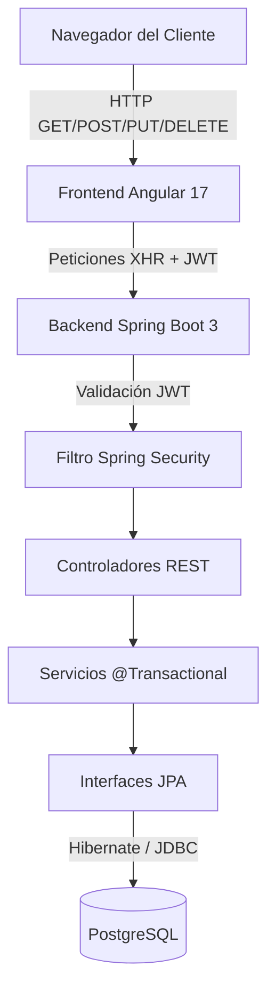

# Documentación Técnica Exhaustiva - Sistema de Inventario Farmacéutico

No hay un límite estricto de líneas para un archivo Markdown. Esta documentación ha sido diseñada para ser lo más detallada y extensa posible, explicando el propósito, la lógica y el código de cada archivo crucial que conforma este sistema CRUD.

---

## ÍNDICE
1. [Arquitectura del Sistema](#1-arquitectura-del-sistema)
2. [Backend: Capa de Base de Datos (Entidades)](#2-backend-capa-de-base-de-datos-entidades)
3. [Backend: Capa de Acceso a Datos (Repositorios)](#3-backend-capa-de-acceso-a-datos-repositorios)
4. [Backend: Capa de Seguridad (Spring Security y JWT)](#4-backend-capa-de-seguridad-spring-security-y-jwt)
5. [Backend: Capa de Negocio (Servicios)](#5-backend-capa-de-negocio-servicios)
6. [Backend: Capa de Presentación (Controladores)](#6-backend-capa-de-presentación-controladores)
7. [Frontend: Configuración y Seguridad (Angular 17)](#7-frontend-configuración-y-seguridad-angular-17)
8. [Frontend: Componente Raíz y Estado Global](#8-frontend-componente-raíz-y-estado-global)
9. [Frontend: Módulo de Productos (El Core del CRUD)](#9-frontend-módulo-de-productos-el-core-del-crud)
10. [Frontend: Módulo de Usuarios y Roles](#10-frontend-módulo-de-usuarios-y-roles)

---

## 1. Arquitectura del Sistema

El sistema utiliza una arquitectura de microservicios lógicos donde el **Frontend** y el **Backend** están completamente desacoplados. Se comunican exclusivamente mediante peticiones HTTP(S) transmitiendo datos en formato JSON.



---

## 2. Backend: Capa de Base de Datos (Entidades)

Las entidades son clases de Java mapeadas directamente a tablas en la base de datos PostgreSQL utilizando JPA (Java Persistence API) y Hibernate.

### `Product.java`
Este archivo define la estructura de la tabla `Product`. Cada instancia de esta clase representa un registro (fila) en la base de datos.
```java
@Entity
@Table(name = "Product")
public class Product {
    @Id // Define la llave primaria
    @GeneratedValue(strategy = GenerationType.IDENTITY) // Autoincremental
    private Long id;
    
    private String name;
    private String description;
    private Long price;
    private Long stock;
    private String category;
    
    @Column(columnDefinition = "TEXT") // TEXT permite almacenar cadenas muy largas (Base64)
    private String imageBase64;

    @ManyToOne // Relación N:1 -> Muchos productos pertenecen a 1 usuario
    @JoinColumn(name = "user_id", nullable = false) // Crea la columna foránea
    private User user;
    
    // Getters y Setters...
}
```
**Explicación:** Se almacena la imagen del producto directamente como un string en formato Base64. Esto simplifica la arquitectura al no depender de servidores de almacenamiento como AWS S3, a costa del tamaño de la base de datos. La relación `@ManyToOne` permite saber *quién* registró el artículo originalmente.

### `User.java`
Representa a los empleados o dueños del sistema.
```java
@Entity
@Table(name = "users")
public class User implements UserDetails {
    @Id
    @GeneratedValue(strategy = GenerationType.IDENTITY)
    private Long id;

    @Column(unique = true) // El username no se puede repetir
    private String username;
    private String password; // Se almacena hasheada (BCrypt)
    private String role; // "ROLE_USER", "ROLE_ADMIN", "ROLE_OWNER"
    
    // Métodos obligatorios de UserDetails (Spring Security)
    @Override
    public Collection<? extends GrantedAuthority> getAuthorities() {
        // Convierte el String del rol en una autoridad que Spring pueda entender
        return List.of(new SimpleGrantedAuthority(role));
    }
    // ...
}
```

---

## 3. Backend: Capa de Acceso a Datos (Repositorios)

Los repositorios utilizan `Spring Data JPA` para generar consultas SQL automáticamente, sin necesidad de escribir código.

### `ProductRepository.java`
```java
public interface ProductRepository extends JpaRepository<Product, Long> {
    // Al extender JpaRepository, Spring genera automáticamente:
    // - findAll() (con soporte para paginación)
    // - findById()
    // - save()
    // - delete()
}
```

### `UserRepository.java`
```java
public interface UserRepository extends JpaRepository<User, Long> {
    // Spring parsea el nombre de este método y genera la consulta:
    // SELECT * FROM users WHERE username = ?
    Optional<User> findByUsername(String username);
}
```

---

## 4. Backend: Capa de Seguridad (Spring Security y JWT)

La seguridad se maneja mediante *JSON Web Tokens* (JWT), asegurando que la API sea "Stateless" (sin sesiones en memoria).

### `SpringSecurityConfig.java`
Es la aduana principal del sistema. Define qué rutas están abiertas y cuáles están restringidas por roles.
```java
@Bean
public SecurityFilterChain securityFilterChain(HttpSecurity http) throws Exception {
    return http
        .cors(Customizer.withDefaults()) // Habilita peticiones cruzadas (CORS)
        .csrf(AbstractHttpConfigurer::disable) // Deshabilita CSRF (Innecesario en APIs stateless)
        .sessionManagement(session -> session.sessionCreationPolicy(SessionCreationPolicy.STATELESS))
        .authorizeHttpRequests(auth -> auth
            // Rutas de Login y Registro son públicas
            .requestMatchers("/api/auth/**").permitAll()
            
            // Cualquier usuario logueado puede VER los productos
            .requestMatchers(HttpMethod.GET, "/api/products/**").authenticated()
            
            // Solo el rol OWNER puede entrar a la gestión de usuarios
            .requestMatchers("/api/users/**").hasRole("OWNER")
            
            // Solo ADMIN y OWNER pueden modificar productos
            .requestMatchers(HttpMethod.POST, "/api/products/**").hasAnyRole("ADMIN", "OWNER")
            .requestMatchers(HttpMethod.PUT, "/api/products/**").hasAnyRole("ADMIN", "OWNER")
            .requestMatchers(HttpMethod.DELETE, "/api/products/**").hasAnyRole("ADMIN", "OWNER")
            
            .anyRequest().permitAll())
        // Añade nuestro filtro JWT antes del filtro convencional de Spring
        .addFilterBefore(jwtAuthenticationFilter, UsernamePasswordAuthenticationFilter.class)
        .build();
}
```

### `JwtAuthenticationFilter.java`
Este código intercepta CADA petición al backend.
```java
@Override
protected void doFilterInternal(HttpServletRequest request, HttpServletResponse response, FilterChain filterChain) {
    // 1. Extrae el header "Authorization"
    String authHeader = request.getHeader("Authorization");
    
    // 2. Si empieza con "Bearer ", extrae el token
    if (authHeader != null && authHeader.startsWith("Bearer ")) {
        String token = authHeader.substring(7);
        // 3. Valida la firma criptográfica del token
        if (jwtTokenProvider.validateToken(token)) {
            // 4. Extrae el usuario y avisa a Spring Security que está autenticado
            String username = jwtTokenProvider.getUsernameFromToken(token);
            UserDetails userDetails = userDetailsService.loadUserByUsername(username);
            
            UsernamePasswordAuthenticationToken authentication = new UsernamePasswordAuthenticationToken(
                    userDetails, null, userDetails.getAuthorities());
            SecurityContextHolder.getContext().setAuthentication(authentication);
        }
    }
    // 5. Permite que la petición continúe
    filterChain.doFilter(request, response);
}
```

---

## 5. Backend: Capa de Negocio (Servicios)

Aquí reside la inteligencia y reglas de negocio del sistema, marcadas con `@Transactional` para asegurar la integridad de la base de datos si ocurre un error en medio de una operación.

### `ProductServiceImpl.java`
Contiene la lógica de cómo se manipulan los productos.
```java
@Override
@Transactional(readOnly = true) // Optimiza la consulta en BD indicando que es solo lectura
public Page<Product> findAllForCurrentUser(Pageable pageable) {
    // Se extrae todo el inventario de manera global
    return productRepository.findAll(pageable);
}

@Override
@Transactional // Bloquea la fila en la BD para escritura segura
public Product updateForCurrentUser(Long id, Product product) {
    // 1. Verifica que el producto exista
    Product existing = productRepository.findById(id)
            .orElseThrow(() -> new ResponseStatusException(HttpStatus.NOT_FOUND, "Producto no encontrado"));

    // 2. Prepara la actualización
    product.setId(id);
    
    // 3. REGLA CLAVE: Un admin puede editar un producto de otro usuario, 
    // pero el sistema NO DEBE borrar quién fue el creador original.
    product.setUser(existing.getUser()); 
    
    // 4. Guarda en BD
    return productRepository.save(product);
}
```

---

## 6. Backend: Capa de Presentación (Controladores)

Los controladores traducen las peticiones HTTP (URL + Body JSON) hacia llamadas de la capa de Servicios.

### `ProductController.java`
```java
@RestController // Indica que devuelve JSON, no plantillas HTML
@RequestMapping("/api/products") // Prefijo de la URL
public class ProductController {
    
    // ... inyección de ProductService ...

    @GetMapping
    public ResponseEntity<Page<Product>> list(
            @RequestParam(defaultValue = "0") int page,
            @RequestParam(defaultValue = "10") int size) {
        // Maneja la paginación de la API (ej. /api/products?page=0&size=10)
        Pageable pageable = PageRequest.of(page, size);
        return ResponseEntity.ok(productService.findAllForCurrentUser(pageable));
    }

    @PostMapping
    public ResponseEntity<Product> create(@RequestBody Product product) {
        // Convierte el JSON entrante en un objeto Product de Java
        Product savedProduct = productService.createForCurrentUser(product);
        return ResponseEntity.status(HttpStatus.CREATED).body(savedProduct);
    }
}
```

---

## 7. Frontend: Configuración y Seguridad (Angular 17)

En Angular 17 se utilizan **Standalone Components** (no existe `app.module.ts`), lo que hace el código más limpio e importable directamente donde se necesita.

### `auth.interceptor.ts`
Un interceptor intercepta las peticiones HTTP salientes desde el cliente hacia el servidor.
```typescript
export const authInterceptor: HttpInterceptorFn = (req, next) => {
  // 1. Intenta sacar el token de la bóveda (localStorage)
  const token = localStorage.getItem('token');
  
  if (token) {
    // 2. Si existe, CLONA la petición original agregando el encabezado de autorización
    const cloned = req.clone({
      headers: req.headers.set('Authorization', `Bearer ${token}`)
    });
    // 3. Envía la petición clonada
    return next(cloned);
  }
  // Si no hay token, envía la petición desnuda
  return next(req);
};
```

### `auth.guard.ts`
Protege las rutas visuales. Si el usuario escribe `/products` en el navegador pero no está logueado, es redirigido.
```typescript
export const authGuard: CanActivateFn = (route, state) => {
  const authService = inject(AuthService);
  const router = inject(Router);
  
  if (authService.isAuthenticated()) {
    return true; // Acceso concedido
  }
  // Acceso denegado, forzar redirección
  return router.parseUrl('/login');
};
```

---

## 8. Frontend: Componente Raíz y Estado Global

### `app.component.ts`
El corazón visual de la app. Contiene la Sidebar, el Header y el sistema de búsqueda.
Usa fuertemente **Signals** (ej. `signal(true)`) para manejar estados de manera ultra-rápida sin depender de ciclos de vida pesados.

```typescript
export class AppComponent implements OnInit {
  isDark = signal(true); // Controla el tema oscuro
  isSidebarOpen = signal(true); // Controla si el menú lateral está abierto
  public productService = inject(ProductService);

  // Cada vez que se teclea en el buscador de la cabecera:
  onSearch(term: string) {
    // Actualiza la señal global de búsqueda
    this.productService.searchTerm.set(term);
  }

  // Al dar clic en la 'X' de la barra de búsqueda
  clearSearch(input: HTMLInputElement) {
    input.value = '';
    this.productService.searchTerm.set(''); // Vacia el filtro
  }
}
```

---

## 9. Frontend: Módulo de Productos (El Core del CRUD)

### `product.component.ts` (Lógica e Inteligencia Reactiva)
Aquí se demuestra la potencia de `computed()` en Angular 17.

```typescript
export class ProductComponent implements OnInit {
  // Estado local (Signals)
  products = signal<Product[]>([]);
  imageToView = signal<string | null>(null);
  productDetails = signal<Product | null>(null);

  // COMPUTED: Se recalcula automáticamente si 'searchTerm' o 'products' cambian.
  // Es decir, al teclear, esto filtra la tabla sin necesidad de apretar "Enter".
  filteredProducts = computed(() => {
    const term = this.service.searchTerm().toLowerCase();
    return this.products().filter(
      (p) => p.name.toLowerCase().includes(term) || p.description.toLowerCase().includes(term)
    );
  });
  
  // Llama al backend (POST/PUT)
  addProduct(product: Product): void {
    if (product.id > 0) {
      this.service.update(product).subscribe({...});
    } else {
      this.service.create(product).subscribe({...});
    }
  }
}
```

### `product.component.html` (Vista y Modales)
La vista itera reactivamente sobre el array `filteredProducts()`.
Se destacan los modales para experiencia de usuario:

```html
<!-- Celdas de la tabla HTML -->
<td data-label="NOMBRE">
  <!-- Si hay imagen base64, se muestra como miniatura clickeable -->
  <div class="icon-box-small" (click)="product.imageBase64 ? imageToView.set(product.imageBase64) : null">
     
  </div>
</td>

<!-- Modal que se activa automáticamente cuando imageToView tiene datos -->
@if (imageToView()) {
  <div class="modal-overlay" (click)="imageToView.set(null)">
      <!-- Renderiza la foto en grande -->
      
  </div>
}
```

### `product.component.css` (Magia Responsiva de Tarjetas)
En móviles, una tabla HTML tradicional crea un molesto *scroll* horizontal. Para evitarlo, usamos CSS moderno para desmontar la tabla.

```css
@media (max-width: 768px) {
  /* 1. Ocultar los encabezados <th> originales */
  .data-table thead { display: none; }
  
  /* 2. Forzar que las filas <tr> se comporten como cajas (Tarjetas) */
  .data-table tr {
    display: block;
    margin-bottom: 16px;
    border-radius: 8px;
  }
  
  /* 3. Forzar que las celdas <td> sean renglones flexibles */
  .data-table td {
    display: flex;
    justify-content: space-between;
  }
  
  /* 4. Inyectar un "pseudo-elemento" antes del contenido de la celda.
        Esto lee el atributo HTML data-label="NOMBRE" y lo pone como título */
  .data-table td::before {
    content: attr(data-label);
    font-weight: 600;
  }
}
```
*Esto provoca que en escritorio se vea como tabla tabular, pero en celular se apile como un formulario.*

### `product-form.component.ts` (Formularios Reactivos)
Utiliza `ReactiveFormsModule` para evitar validar inputs manualmente en HTML.
```typescript
productForm = this.fb.nonNullable.group({
    id: [0],
    name: ['', [Validators.required, Validators.minLength(5)]], // Exige nombre de 5 letras
    description: ['', [Validators.required]],
    price: [0, [Validators.required, Validators.min(0)]], // No permite precios negativos
});

onSubmit(): void {
    if (this.productForm.invalid) {
      this.productForm.markAllAsTouched(); // Pinta los bordes rojos si hay errores
      return;
    }
    // Emite los datos hacia el componente padre (product.component.ts)
    this.newProductEvent.emit(this.productForm.getRawValue());
}
```

---

## 10. Frontend: Módulo de Usuarios y Roles

La gestión de accesos (Solo para el Rol Dueño).

### `users.component.html`
Se despliega un selector `<select>` incrustado en cada fila de usuario.
```html
<td data-label="ROL">
  <!-- ngModel ata el valor del select al objeto usuario.
       ngModelChange se dispara al elegir otra opción -->
  <select 
    [ngModel]="user.role" 
    (ngModelChange)="onRoleChange(user, $event)"
    [disabled]="user.role === 'ROLE_OWNER'">
    
    <option value="ROLE_USER">Empleado (Sin Permisos)</option>
    <option value="ROLE_ADMIN">Administrador</option>
  </select>
</td>
```

### `users.component.ts`
El controlador envía el nuevo rol al servidor para actualizar la base de datos inmediatamente.
```typescript
onRoleChange(user: any, newRole: string) {
  // Petición PUT hacia el servidor
  this.userService.updateRole(user.id, newRole).subscribe({
    next: () => {
      // Actualiza la UI de manera silenciosa
      user.role = newRole;
      this.toastService.show('Rol actualizado', 'success');
    }
  });
}
```

---
*Fin de la Documentación Técnica.*
